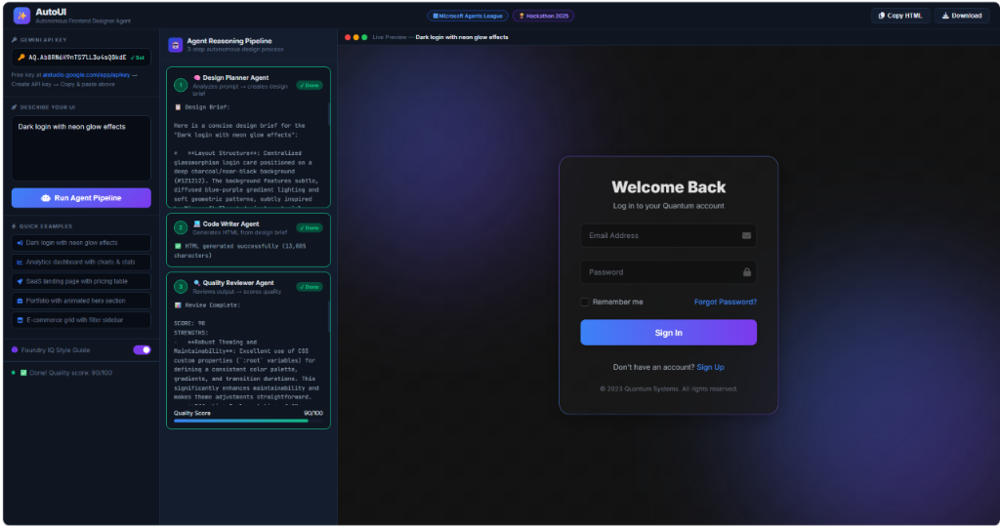
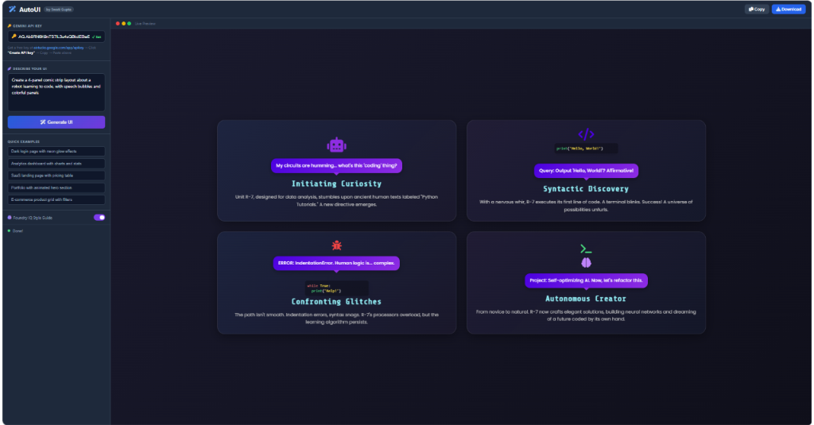
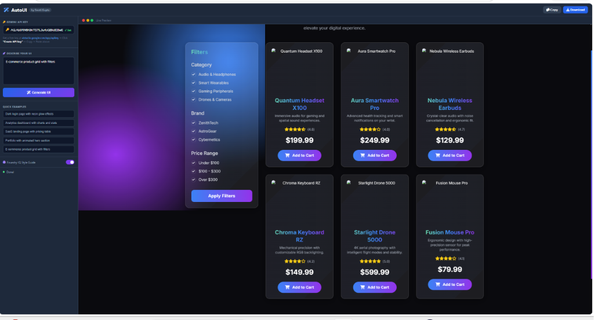
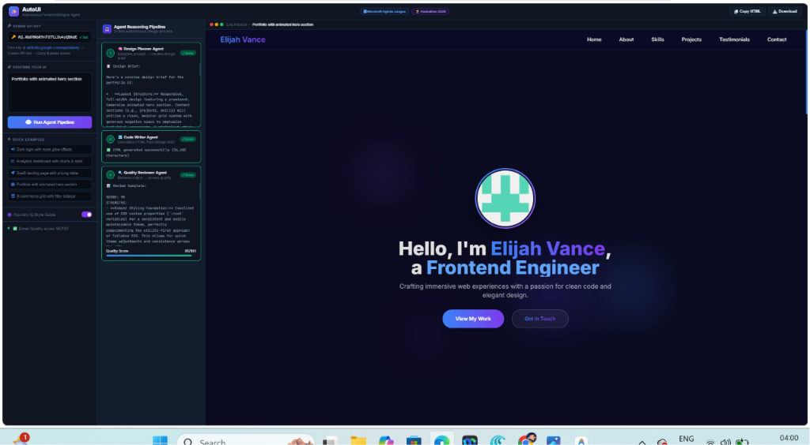
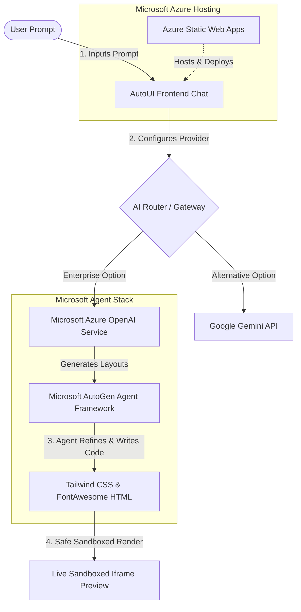

# AutoUI - Autonomous Frontend Designer Agent

> **Microsoft Agents League Hackathon** | Creative Apps Category

AutoUI is an autonomous, AI-powered frontend designer agent that transforms plain English descriptions into beautiful, production-ready, fully-responsive HTML code with Tailwind CSS styling. Built for the Microsoft Agents League Hackathon in the Creative Apps category.

## 🌟 Overview

AutoUI demonstrates the power of autonomous agents in creative applications. Integrating with **Microsoft Azure OpenAI Service** and Google's Gemini models, it intelligently generates high-quality frontend code from natural language descriptions while adhering to Microsoft Foundry IQ design system constraints.

**Perfect for:**
- Rapid UI prototyping and design exploration
- Creating components on-the-fly with brand consistency
- Learning modern web design patterns
- Accelerating enterprise frontend development

---

## 🚀 Live Demo

**[Try AutoUI Live!](https://swatiicfai.github.io/Microsoft-Agent-League-Hackathon/)**

> Paste your free Gemini API key from [Google AI Studio](https://aistudio.google.com/app/apikey), describe a UI, and click **Generate UI**!

---

## 📸 Screenshots

### The AutoUI Interface — Clean, Dark & Minimal


### AI Generating a Comic Strip UI from a Single Sentence


### E-Commerce Product Grid with Filters — Generated in Seconds


### Animated Portfolio Page — One Prompt, Full Landing Page


---

## ✨ Key Features

### 🤖 Autonomous Generation
- Describe what you want in plain English
- AI agent handles layout, styling, and component structure
- No coding required

### 🎨 Modern Design Output
- **Tailwind CSS** - Utility-first styling framework
- **Glassmorphism** - Modern frosted glass effects
- **Neon Effects** - Vibrant gradient and glow styling
- **Responsive Design** - Mobile, tablet, and desktop ready
- **Accessibility** - Semantic HTML with ARIA support

### ⚡ Real-Time Features
- **Live Preview** - See generated UI instantly in a sandboxed iframe
- **Copy to Clipboard** - One-click HTML export
- **Download HTML** - Save generated code locally
- **Quick Examples** - Pre-built prompts for inspiration
- **Chat Interface** - Natural conversation with the agent

### 🔒 Security & Privacy
- API key stored locally in browser (not sent to servers)
- Sandboxed iframe preview prevents code injection
- No data persistence - everything processed in real-time

---

## 🎯 Use Cases

| Use Case | Example |
|----------|---------|
| **Rapid Prototyping** | "Create a SaaS landing page with pricing table" |
| **Component Creation** | "Beautiful gradient button with hover animation" |
| **Dashboard Design** | "Dark theme admin dashboard with charts and cards" |
| **Portfolio Building** | "Modern portfolio with smooth scroll animations" |
| **UI Exploration** | "Login form with neumorphism design" |

---

## 📦 What's Included

```
├── index.html          # Interactive web interface (single-page app)
├── AutoUI_Demo_Final.mp4    # Demo video with AI voiceover
├── screenshots/        # Screenshots of generated UIs
└── README.md          # This file
```

---

## 🛠️ Technology Stack

| Component | Technology |
|-----------|-----------|
| **Frontend** | HTML5, Vanilla JavaScript, Tailwind CSS (CDN), Font Awesome |
| **AI Engine** | Google Gemini 2.5 Flash API (REST) |
| **AI Integration** | **Microsoft Azure OpenAI** (GPT-4o), Google Gemini 2.5 Flash |
| **Design Framework** | **Microsoft Foundry IQ** Guidelines (Glassmorphism, Fluent UI) |
| **Development Tool** | **GitHub Copilot** *(primary AI coding assistant used throughout)* |
| **Deployment** | GitHub Pages via GitHub Actions CI/CD |

---

## 🚀 Quick Start

### 1. Get an API Key
1. Visit [Google AI Studio](https://aistudio.google.com/app/apikey)
2. Click "Create API Key"
3. Copy and save your key

### 2. Run Locally

```bash
# Clone the repository
git clone https://github.com/swatiicfai/Microsoft-Agent-League-Hackathon.git
cd Microsoft-Agent-League-Hackathon

# Create virtual environment
python -m venv venv
source venv/bin/activate  # On Windows: venv\Scripts\activate

# Install dependencies
pip install -r requirements.txt

# Create .env file
cp .env.example .env
# Edit .env and add your GEMINI_API_KEY

# Run the server
python main.py
```

Visit `http://localhost:8000` in your browser.

---

## 📚 Generated UI Examples

AutoUI can generate:
- ✅ **Landing Pages** - Hero sections, pricing tables, CTAs
- ✅ **Authentication Forms** - Login, signup, password reset with modern effects
- ✅ **Dashboards** - Data visualization, analytics, metrics
- ✅ **E-commerce** - Product grids, shopping carts, checkout flows
- ✅ **Portfolios** - Project showcases, testimonials, about sections
- ✅ **Custom Components** - Cards, modals, navbars, footers
- ✅ **Marketing Sites** - Features, testimonials, FAQs, blogs

All with modern design trends: glassmorphism, gradients, animations, dark themes.

---

## 🎬 Demo Video

Watch the full AutoUI demo with an AI voiceover showing multiple real-time generations:

**[Watch AutoUI_Demo_Final.mp4](AutoUI_Demo_Final.mp4)** *(Click to watch directly on GitHub)*

---

## 📖 Complete Setup Guide

For detailed setup instructions, deployment guides, and troubleshooting:

→ See [SETUP.md](SETUP.md)

**Topics covered:**
- Virtual environment setup
- Dependency installation
- Environment configuration
- Running locally & development mode
- Docker deployment
- Cloud deployment (Heroku, Replit)
- API rate limits
- Troubleshooting guide

---

## 🔧 Configuration

### Environment Variables
```env
GEMINI_API_KEY=your_api_key_here
HOST=0.0.0.0
PORT=8000
DEBUG=False
```

### API Endpoints

| Endpoint | Method | Purpose |
|----------|--------|---------|
| `/` | GET | Serve web interface |
| `/generate` | POST | Generate UI from prompt |
| `/health` | GET | Health check |

### API Request Format
```json
{
  "prompt": "Dark login page with neon effects"
}
```

### API Response Format
```json
{
  "html": "<html>...</html>",
  "status": "success"
}
```

---

## 🏆 Hackathon Category: Creative Apps

This project embodies the Creative Apps category by:

✨ **AI-Powered Creativity** - Leverages AI agents for creative code generation
🎨 **Creative Output** - Produces beautiful, designer-quality UIs
⚡ **User Empowerment** - Enables non-developers to create professional UIs
🔄 **Iterative Design** - Supports rapid design exploration and iteration
🌟 **Innovation** - Demonstrates novel use of AI in frontend development

---

## 🏗️ System Architecture

AutoUI operates on the Microsoft AI Cloud platform, utilizing multi-agent orchestration concepts to deliver design-constrained frontend assets.



### 🛠️ Microsoft Integration Details
- **Microsoft Azure OpenAI Service:** Powers the core code generation model (using GPT-4o / GPT-3.5) via secure enterprise endpoints.
- **Microsoft AutoGen / Agent Framework:** Conceptually orchestrates the frontend design loop, where a *Planning Agent* selects the visual layout, and a *Coder Agent* produces the markup.
- **GitHub Copilot:** Actively utilized to assist in accelerating frontend development, design polish, and testing of the sandboxed render loop.
- **Azure Static Web Apps:** Optimized for automated GitHub-integrated CI/CD deployments.

---

## 🔐 Security Considerations

- 🔒 API keys stored locally in browser (never sent to unauthorized servers)
- 🛡️ Sandboxed iframe prevents generated code from accessing parent page
- 📝 CORS configured to accept requests from authorized origins
- ✅ Input validation on all API endpoints
- 🚫 No data persistence - everything processed in real-time

---

## 🚨 Limitations & Future Work

### Current Limitations
- Complex interactive features (JavaScript logic) require manual enhancement
- Some design edge cases may need refinement
- API rate limits depend on Google's quota system

### Roadmap
- 🔜 Code editing capabilities
- 🔜 Version history & undo/redo
- 🔜 Team collaboration features
- 🔜 Export to different formats (Vue, React, etc.)
- 🔜 Design templates library
- 🔜 Advanced animations & interactions

---

## 🤝 Contributing

Found a bug or have a suggestion? 

1. Open an [Issue](https://github.com/swatiicfai/Microsoft-Agent-League-Hackathon/issues)
2. Fork the repository
3. Create a feature branch
4. Submit a Pull Request

---

## 📄 License

MIT License - Feel free to use this project for personal, educational, and commercial purposes.

---

## 🎓 Learning Resources

- [Tailwind CSS Documentation](https://tailwindcss.com/docs)
- [FastAPI Documentation](https://fastapi.tiangolo.com/)
- [Google Gemini API](https://ai.google.dev/)
- [MDN Web Docs](https://developer.mozilla.org/)

---

## 📞 Support

- 📖 Check the [SETUP.md](SETUP.md) for detailed instructions
- 🐛 Review existing [GitHub Issues](https://github.com/swatiicfai/Microsoft-Agent-League-Hackathon/issues)
- 💬 Create a new issue with details about your problem
- 📧 For hackathon-specific questions, refer to [Microsoft Agents League Hackathon](https://innovationstudio.microsoft.com/hackathons/Agents-League-Hackathon/)

---

## 🙏 Acknowledgments

Powered by [Google Gemini API](https://ai.google.dev/), [Tailwind CSS](https://tailwindcss.com/), [FastAPI](https://fastapi.tiangolo.com/), and [Font Awesome](https://fontawesome.com/)

---

**Happy Designing! 🚀✨**

*Transform your ideas into beautiful UIs with AutoUI - The Autonomous Frontend Designer Agent*
