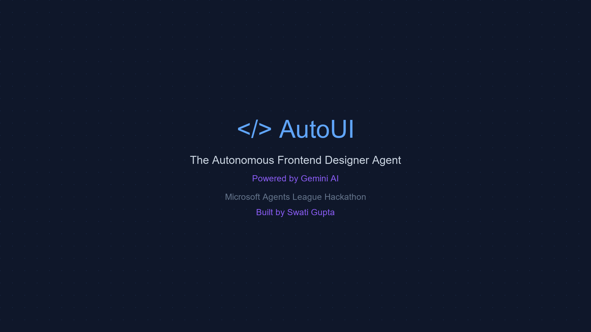
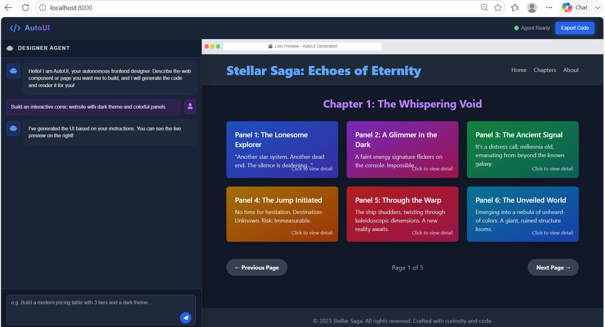
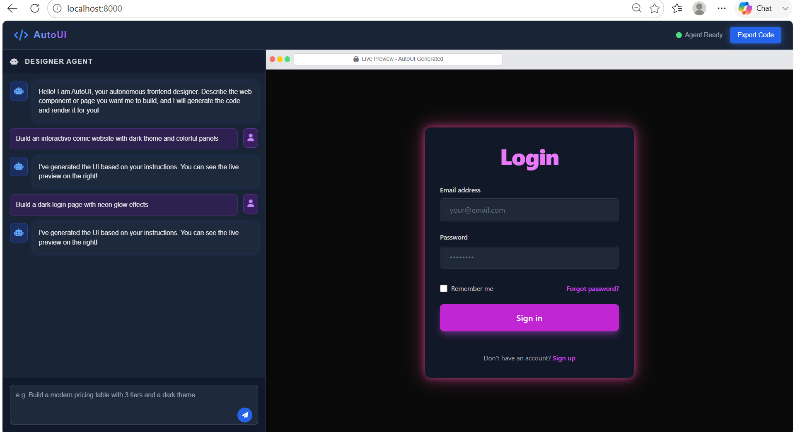
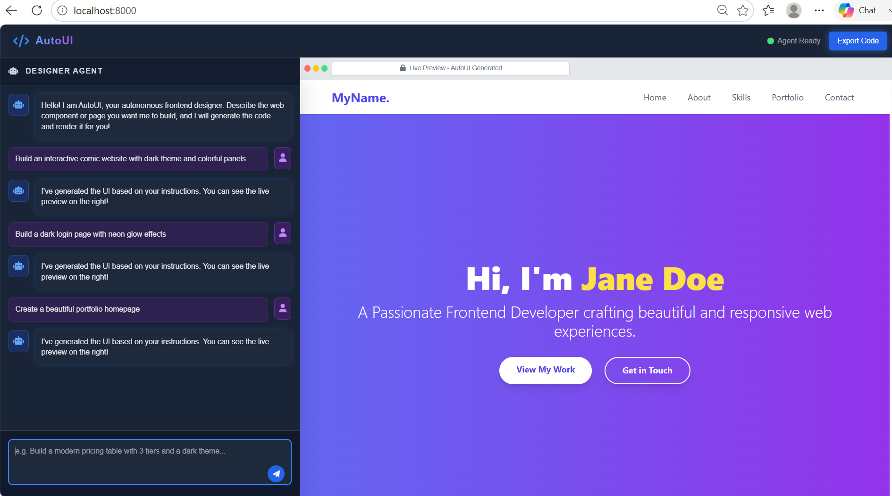

# AutoUI - The Autonomous Frontend Designer Agent



AutoUI is an autonomous, AI-powered frontend designer agent built for the **Microsoft Agents League Hackathon**. It transforms plain English descriptions into beautiful, production-ready, fully-responsive user interfaces in seconds.

## 🚀 Live Demo

**[Try AutoUI Live!](https://swatiicfai.github.io/Microsoft-Agent-League-Hackathon/)**

*(Note: To use the live demo, you will need to provide your own Gemini API Key in the top right corner.)*

---

## 🎬 Demo Video

Watch the full AutoUI demo with AI voiceover showing 3 completely different generations in real-time:

[**AutoUI_Demo.mp4**](AutoUI_Demo.mp4) *(Download or click to watch)*

---

## ✨ Features

- **Autonomous Generation:** Just describe what you want, and the agent handles layout, styling, and structure.
- **Production-Ready Code:** Generates clean, modern HTML using Tailwind CSS.
- **Live Preview:** Instant, rendered preview of your UI right inside the app using a secure sandboxed iframe.
- **Modern Aesthetics:** Built-in system prompts encourage modern design trends like glassmorphism, neon effects, and dark themes.

---

## 📸 Screenshots

Here are some real examples of what AutoUI can generate from a single prompt:

### 1. Interactive Comic Website
**Prompt:** *"Build an interactive comic website with dark theme and colorful panels"*


### 2. Neon Login Page
**Prompt:** *"Build a dark login page with neon pink glow effects and glassmorphism card"*


### 3. Beautiful Portfolio
**Prompt:** *"Beautiful portfolio homepage"*


---

## 💻 Run Locally

You can run AutoUI locally using the included Python FastAPI backend:

1. Clone the repository
2. Install the required dependencies:
   ```bash
   pip install fastapi uvicorn google-genai
   ```
3. Set your Gemini API key in `main.py`
4. Run the server:
   ```bash
   python main.py
   ```
5. Open `http://localhost:8000` in your browser.

---

## 🛠️ Technology Stack

- **Frontend:** HTML, JavaScript, Tailwind CSS
- **Backend (Optional):** Python, FastAPI
- **AI Model:** Google Gemini 2.5 Flash (`google-genai` SDK)

---
*Built with ❤️ by Swati Gupta for the Microsoft Agents League Hackathon 2024*
